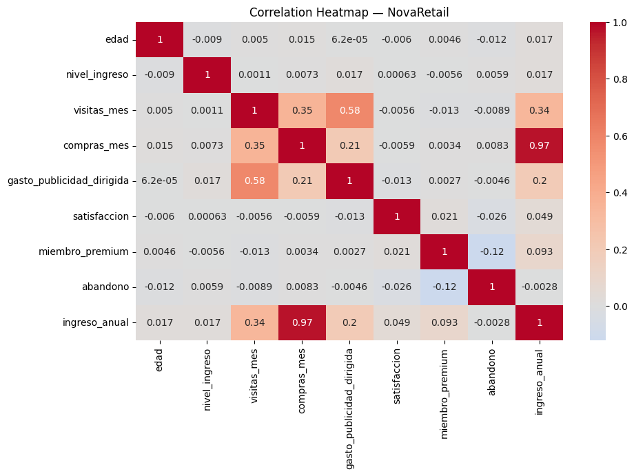
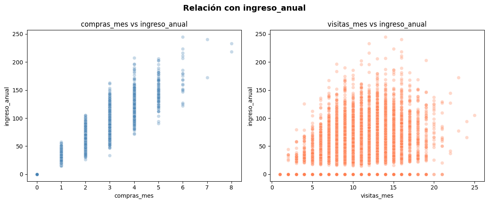
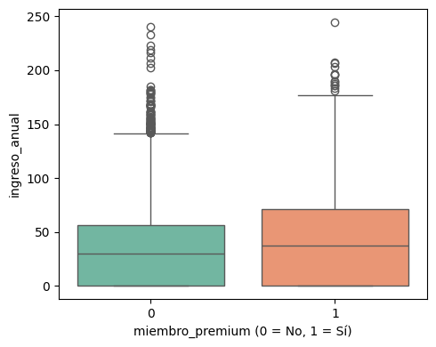

# 📊 NovaRetail+ — Análisis Correlacional de Comportamiento del Cliente

Análisis correlacional aplicado a una plataforma de comercio electrónico latinoamericana con millones de usuarios. El proyecto identifica qué factores del comportamiento del cliente están más fuertemente asociados con el ingreso anual generado.

**Herramientas:** Python · Pandas · NumPy · Seaborn · Matplotlib · SciPy

## 🔍 Hallazgos Principales

**Factor más asociado con ingreso anual**
- `compras_mes` presenta una correlación de 0.97 con `ingreso_anual`, confirmada como estable con Pearson y Spearman.
- Se identificó un posible riesgo de colinealidad — ambas variables podrían estar midiendo el mismo fenómeno.

**Segmento premium**
- Los clientes con suscripción premium tienden a generar mayor ingreso anual (punto biserial: 0.093, p-value: 0.000).
- El boxplot confirma una mediana de ingreso más alta en el grupo premium, con mayor dispersión.

**Variables sin asociación relevante**
- `edad`, `nivel_ingreso` y `satisfaccion` muestran correlaciones cercanas a 0 con `ingreso_anual` — no son factores determinantes.

## 📈 Visualizaciones

| Heatmap de correlación | Scatterplots clave | Boxplot premium |
|---|---|---|
|  |  |  |

## 💡 Recomendaciones

- Invertir en estrategias que incentiven la frecuencia de compra, como ofertas por tiempo limitado.
- Desarrollar programas de lealtad dirigidos al segmento premium para retener y expandir ese grupo.
- Explorar la relación directa entre `gasto_publicidad_dirigida` e `ingreso_anual` en un análisis posterior.

## 📂 Dataset

| Archivo | Descripción |
|---|---|
| `novaretail_comportamiento_clientes_2024.csv` | 15,000 registros de comportamiento de clientes |

## 🔍 Etapas del Análisis

1. **Preparación de datos** — corrección de tipos, validación de variables binarias y categóricas
2. **Heatmap de correlación** — visión general de relaciones entre todas las variables numéricas
3. **Scatterplots** — evaluación visual de linealidad y outliers en pares clave
4. **Pearson & Spearman** — correlación entre variables numéricas con justificación del método
5. **Punto biserial** — correlación entre variables binarias y numéricas
6. **V de Cramér** — asociación entre variables categóricas
7. **Hallazgos y recomendaciones** — conclusiones con evidencia visual, numérica e implicaciones de negocio

## ▶️ Cómo ejecutar

**Google Colab**

[](https://colab.research.google.com/github/DebbieJara/novaretail-correlation-analysis/blob/main/NovaRetail_Analysis.ipynb)

Haz clic en el badge de arriba y ejecuta las celdas en orden — el dataset ya está en el repositorio.

**Jupyter local**
```bash
git clone https://github.com/DebbieJara/novaretail-correlation-analysis.git
pip install pandas numpy matplotlib seaborn scipy
jupyter notebook
```

Se recomienda ejecutar todas las celdas en orden desde el inicio.

## 👩‍💻 Autora

Debbie Jara · [GitHub](https://github.com/DebbieJara) · Data Analyst en formación
