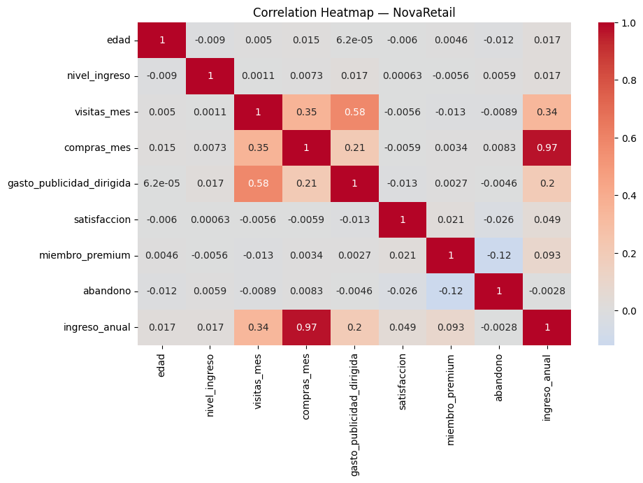
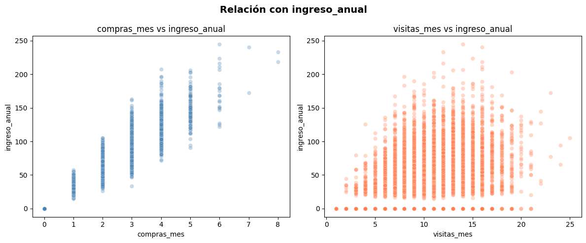
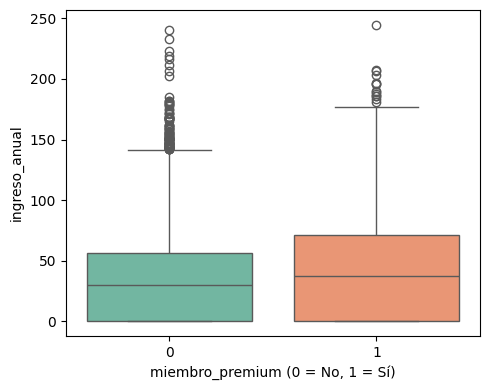

# NovaRetail+ Customer Behavior Correlation Analysis

[](https://colab.research.google.com/github/DebbieJara/novaretail-correlation-analysis/blob/main/NovaRetail_Analysis.ipynb)


**Business question:** Correlation analysis applied to a Latin American e-commerce platform with millions of users. The project identifies which customer behavior factors are most strongly associated with annual revenue generated.

## Context

The dataset covers 15,000 customer behavior records from a Latin American e-commerce platform.

## Process

Data preparation (type correction, validation of binary and categorical variables), a correlation heatmap for an overview of relationships between all numeric variables, scatterplots to visually assess linearity and outliers in key pairs, Pearson and Spearman correlation with method justification, point-biserial correlation between binary and numeric variables, and Cramér's V for association between categorical variables.

## Key findings

### Factor most associated with annual revenue

`compras_mes` (monthly purchases) shows a 0.97 correlation with `ingreso_anual` (annual revenue), confirmed as stable with both Pearson and Spearman. A potential collinearity risk was identified: both variables could be measuring the same underlying phenomenon, since it's unclear whether annual revenue is calculated directly from monthly purchases.

Setting that relationship aside, `visitas_mes` (monthly visits) emerges as the strongest independent factor associated with annual revenue (Pearson 0.337, Spearman 0.321). This is likely the more actionable driver for business strategy, since it isn't confounded by the same collinearity risk.

### Premium segment

Customers with a premium subscription tend to generate higher annual revenue (point-biserial: 0.093, p-value: 0.000). The boxplot confirms a higher median revenue in the premium group, with greater dispersion. Premium members also show lower churn: `miembro_premium` and `abandono` have a negative correlation (-0.12).

Churn itself shows no significant relationship with annual revenue (point-biserial: -0.003, p-value: 0.729): there's no evidence that churn is associated with how much revenue a customer generates.

### Other notable relationship

`visitas_mes` and `gasto_publicidad_dirigida` (targeted advertising spend) show the strongest positive correlation in the entire heatmap (0.58), suggesting that targeted ad spend is associated with higher user activity on the platform.

### Variables with no relevant association

`edad` (age), `nivel_ingreso` (income level), and `satisfaccion` (satisfaction) show correlations close to 0 with annual revenue: they are not determining factors.

## Visualizations



Correlation heatmap: overview of relationships between all numeric variables.



Scatterplots evaluating linearity and outliers in key variable pairs.



Boxplot comparing annual revenue distribution between premium and non-premium customers.

## Recommendations

- Invest in strategies that incentivize purchase frequency, such as limited-time offers.
- Develop loyalty programs targeted at the premium segment to retain and expand that group.
- Explore the direct relationship between `gasto_publicidad_dirigida` (targeted advertising spend) and annual revenue in a follow-up analysis.

## Technical details

### Dataset

| File | Description |
|---|---|
| novaretail_comportamiento_clientes_2024.csv | 15,000 customer behavior records |

### Analytical workflow

| Step | Description |
|---|---|
| 1. Data preparation | Type correction, validation of binary and categorical variables |
| 2. Correlation heatmap | Overview of relationships between all numeric variables |
| 3. Scatterplots | Visual assessment of linearity and outliers in key pairs |
| 4. Pearson & Spearman | Correlation between numeric variables, with method justification |
| 5. Point-biserial | Correlation between binary and numeric variables |
| 6. Cramér's V | Association between categorical variables |
| 7. Findings & recommendations | Conclusions supported by visual evidence, statistics, and business implications |

## Tools

Python · pandas · NumPy · Seaborn · Matplotlib · SciPy

## Repository structure

```text
novaretail-correlation-analysis/
├── README.md
├── NovaRetail_Analysis.ipynb
└── images/
    ├── heatmap.png
    ├── scatterplots.png
    └── boxplot.png
```

---

By Deborah Jara | Business Intelligence · Data Analytics | Mexico
[LinkedIn](https://www.linkedin.com/in/deborahjara) · [GitHub](https://github.com/DebbieJara)
